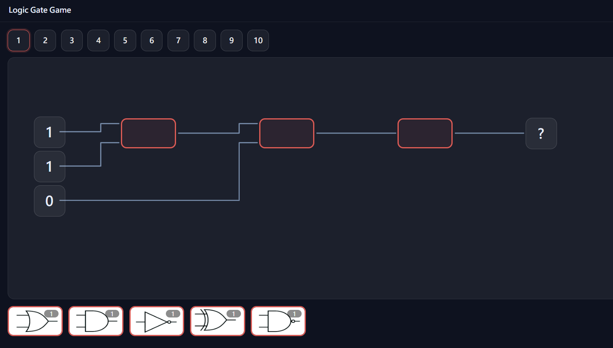
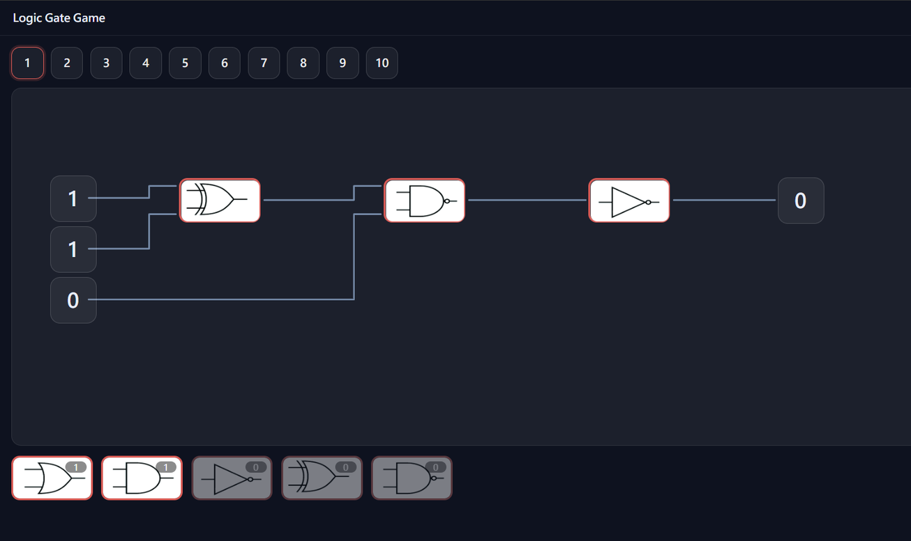

## Vibe coding 的起點
杜鵑花節一直是系上的一個重要活動，還記得陳建宇某天在我們上課上到一半時突然跑過來問我們要不要當大頭？那個時候想都沒想就答應了，意外地開啟了一段頗為有趣的 vibe coding 旅程。

我負責的部分是闖關遊戲組，其實一直以來我們所需要做的主題都很清楚，就是把一個邏輯電路其中的邏輯閘挖空，然後讓來參加的學生們放入正確的邏輯閘以得到output為true，這對應到我們交換電路與邏輯設計的最基本概念，但以往我們都要耗費大量的時間設計題目板以及邏輯閘小卡，某天我就覺得這一切真的都太不方便了，因此我就決定獨自把這所有的東西全部數位化，讓未來的人們可以不需要重工。而我做出來的東西就在這裡 👉 [ChangShengHsun/logicgate_game](https://github.com/ChangShengHsun/logicgate_game)，以下是我一路開發下來的心路歷程。

**一開始**，我想的很單純，就是把一題邏輯電路變成一個網頁：用一份 JSON 描述一題（哪些是輸入 `inputs`、電路上有哪些待填的空格 `slots`、最後的輸出是哪一格 `output`），然後把電路圖畫出來、把邏輯閘做成可以拖曳的卡片放進紅色空格。這一步光是把接腳的邊界對齊、讓拖放能穩定運作，就修了好幾個版本。

**再來我覺得**最關鍵、也最有成就感的，是自己寫了一套「自動計算」的引擎。傳統做法是我要先算好每一題的答案再印在紙上，但我讓程式自己算：核心的 `evaluate()`（在 `src/engine/check.js`）會從輸出那一格開始，沿著每個空格的輸入往回遞迴，一路把數值算回來，中間算過的還會快取起來不重算；而九種邏輯閘（AND、OR、NOT、XOR、NAND⋯⋯）則用最精簡的位元運算定義在 `gates.js`。這樣的好處是——玩家每放進一個閘，畫面上的輸出就會即時重算並更新，還沒放滿的地方就顯示「?」，完全不需要我事先手算或對答案。這中間也踩到不少雷，像是閘的輸入數量（arity，一個 NOT 只吃一個輸入、AND 吃兩個）對不上時會算錯，也一併修掉了。

**再來**，為了讓題目有難度變化，我加上了「每種閘限量」的機制（題目 JSON 裡的 `gateCounts`），也把題目從最初的幾題擴充到十關，並把原本的文字標籤全部換成邏輯閘的圖片，讓現場看起來更直覺。

**為了方便**現場發獎品，我又多做了一個抽獎轉盤（Lucky Draw）：獎項和機率全部寫在 `data.json`，指針停下的機率跟扇形比例完全一致，工作人員只要按一下 `Spin` 就好，不用再手動抽籤、算機率。我還加了一個可以隨時打開的真值表（truth table）讓遊客對照。

**最後**，調整了整體配色、把專案定稿，並寫了一份 README 當作現場操作手冊——連怎麼開伺服器、面向遊客怎麼講解的 SOP 都寫進去了，讓之後接手的學弟妹照著做就能穩定開起來。

當天呢！其實真的很輕鬆，我行前對五人闖關遊戲小組的教育訓練大概也就半個小時就完成了，而且還額外省下了做美工的時間；到了現場一切也都運作得井然有序，闖關完之後要發放的紀念品也都按照著我的計畫進行，一切真是太好了！

