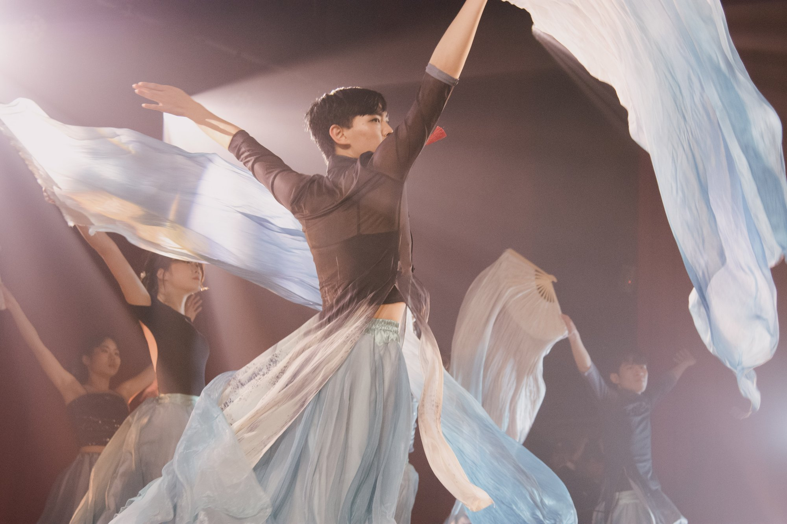
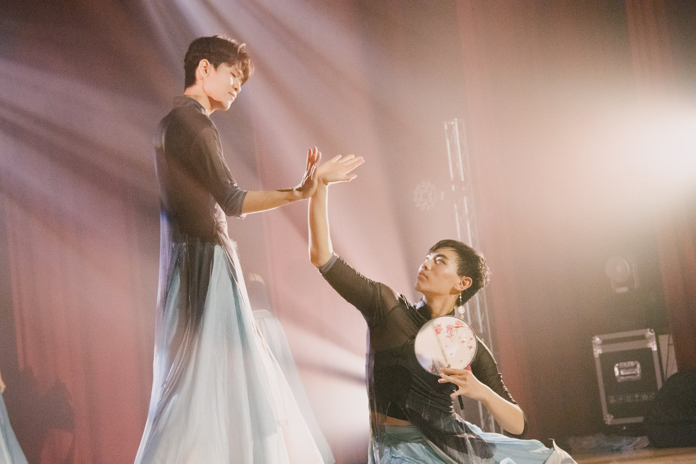
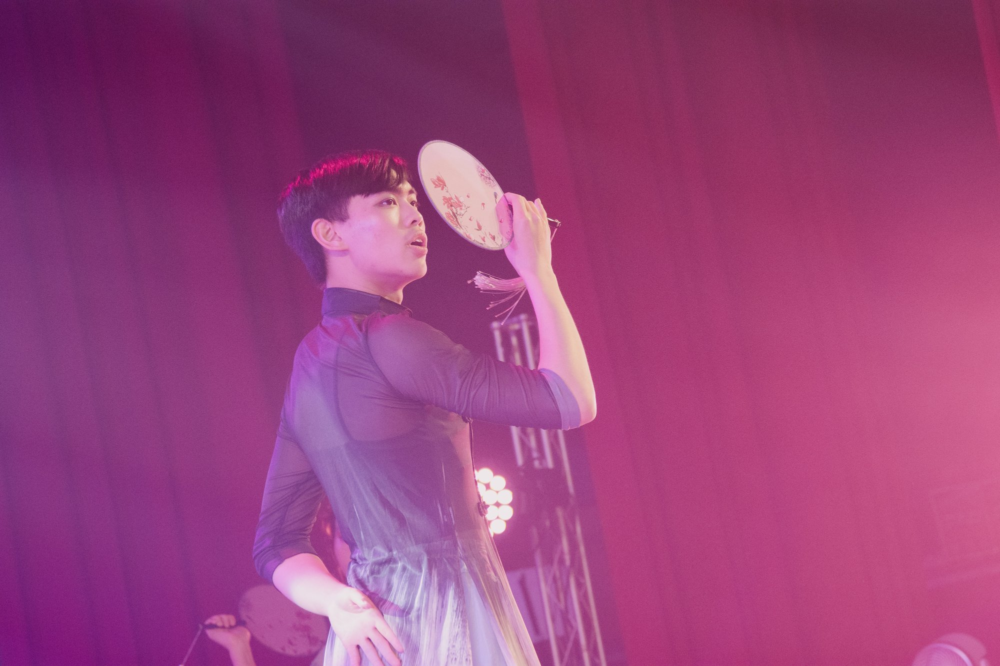

## 緣起

中國舞啊！承載了我許許多多的心力與期盼。這個故事應該是從高中時在 B 站滑到了白小白老師的國風爵士吧！從此便被這種舞風深深吸引，打開了新世界的大門，只能說很想把我眼中的這股美分享給大家啊！每次裙擺轉動、每次扇子飄揚總令我醉心不已，我就是偏愛著這種優雅、含蓄、克制卻又迸發出強烈生命力與美感的視覺效果。

電機系在過去從來沒有關於中國舞的表演，可能是真的大家都很喜歡像是Locking, Popping, KPOP這種比較帥氣節奏感比較強的西方音樂吧？但我人生的信條就是「不做別人做過的事」，而且真的女孩子穿長裙穿漢服真的超級漂亮的啦！好像仙女一樣，所以我就開了這個以往從來沒有人嘗試過的「跨屆中國舞」。

## 準備

謝謝，真的謝謝鄭安妤學姊當初跑來跟我講說想加中國舞，沒有你，這個中國舞就算開成也絕不是如今這般萬人稱頌的演出。你對於美的理解遠在我之上，服飾、妝造、編曲各個方面都是，我只是維持住中國舞的下限，有你中國舞的美才算是真正被展現出來。跟你合作我很愉快，事到如今，我對你剩下的只有感激而已，再來一次，我依然會希望跟你一起開這支舞。

對我來說，儘管有一次大一開女舞的經驗，但排練對我來說依然是個挑戰，有了大一的經驗，讓我在進度安排、隊形編排上能更有系統性地完成，但仍然還有許多問題要處理。首先是音樂編排，因為有三首歌，要如何恰當地把這三首歌流暢地串在一起，我跟鄭安妤共同討論了很久很久，才把音檔定案，而服裝道具也是我們共同討論，參考影片風格以及配色最後討論出來的，我甚至提前了一個月上淘寶訂！衣服才堪堪在表演一周前到。

但最難的終究還是教舞啊！因為大家都很忙，有很多事情要處理，有很多次練習沒辦法全員到齊，所以除了我多花一點時間教那些沒時間來的人之外，我每一次練習都有錄影，數拍、配音樂，讓大夥兒在家也可以自己練習，所謂共同負責人，就是要保證每件小事都能夠流暢進行吧！

## 表演當天
表演當天，只能說也無風雨也無晴吧！其實前面幾次練習大家的狀態都很好了，不該跳的人也不在了，也不是第一次上台不會到太緊張，我只能說，綢扇的效果遠比想像的好，在最後一首左手指月，很明顯地看到大家都是屏氣凝神的在看，在最後掌聲也遠超我想像的久，而且表演完之後還很多人跟我說明年想要加中國舞，看來大家是真的很喜歡這種視覺效果強烈的東西，我應該要來考慮一下明年繼續沿用綢扇、絲巾、紙傘這些視覺效果強烈，涵蓋面積大的道具來玩玩看。

也想謝謝何文璦，電夜總算有一支和你一起跳的舞了，支持我做的許多決定，聽到你說你很喜歡中國舞、明年還會想要跳的時候，我發自內心的有種被認同、被接納的感覺。張勝勛是個很奇怪很不正常的人，謝謝你接受了也支持了他的奇思妙想。

明年沒意外的話還是會有跨屆中國舞，希望會有更多喜歡跳舞（maybe 擅長跳舞）的人加入，也希望這東西在我離開台大後也能被傳承改良下去。
