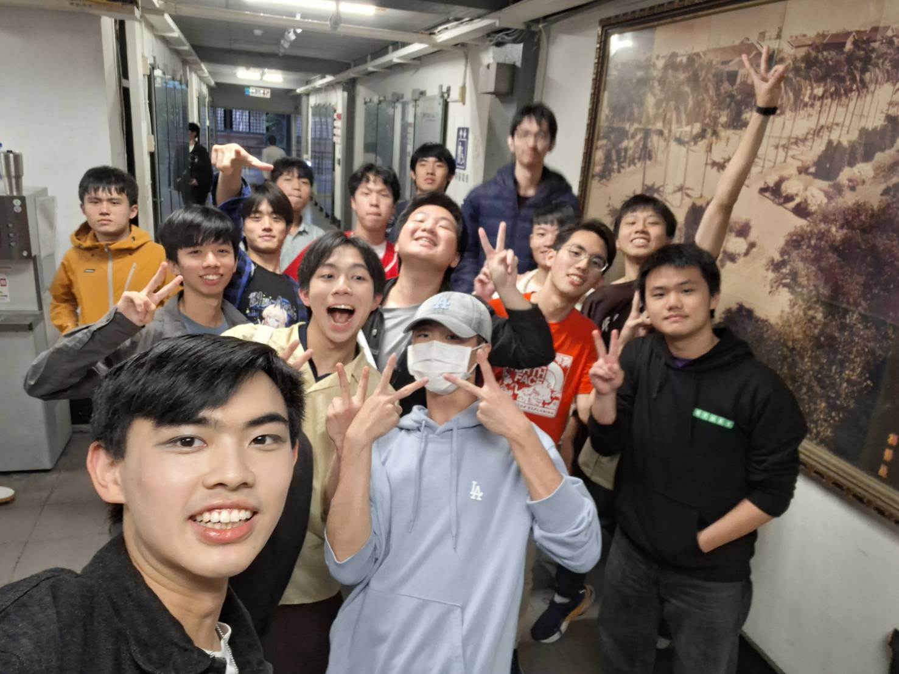

## 準備

串場劇，說實在的一開始本來只是想要進去混個配角當當而已，但默默地好像也幫了不少忙，跟同屆的很多人變得更要好，也認識了很多很有意思的學弟們！（赫然發現串場劇都只有男生！！！）

<!-- TODO(Ivan): 這裡缺你實際做了什麼。
     summary 寫「編劇、場控、共同籌劃、六幕、五十分鐘」，但內文一句都沒提到。
     劇本是怎麼生出來的？六幕在講什麼故事？
     場控在一場五十分鐘的演出裡是在控什麼？
     「本來只想混個配角」怎麼一路變成在寫劇本的？這個轉折是整篇最好看的地方。 -->

## 表演

<!-- TODO(Ivan): 當天完全還沒寫。
     哪一幕最好笑？有沒有出包、然後怎麼救回來的？ -->

最後串場劇的效果很好笑，為眾人帶來了許多歡樂真是太好了！

但說回來串場劇最大的收穫就是跟謝濟遠 @ikandoit_1014 變得很熟吧！一個令人尊敬的學弟，活到 20 歲，總不時會有這種感覺：「這個人一定能比我更強更有成就！」，你也讓我有這種感覺呢！負責認真、聰明能幹，嘛......老實說我應該幫你更多的，有太多時候我的心態有點閃躲飄，讓你焦慮煩惱了很多次我真的很抱歉。雖然你走得比我快很多，能幫上你的應該不多，但有什麼需要還是讓我知道吧！

是說今年演完劇有點演上癮了，明年有點想把跨屆劇魔改成古裝劇（畢竟應該也很多人手上會有漢服了），可以問問電機系的大家會有人有興趣嗎？
