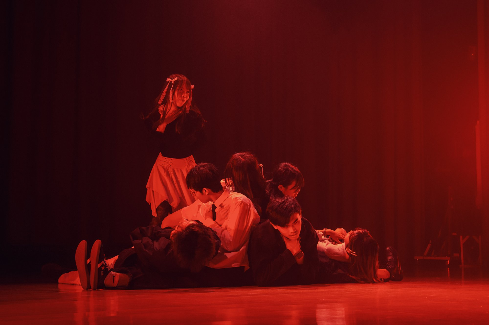
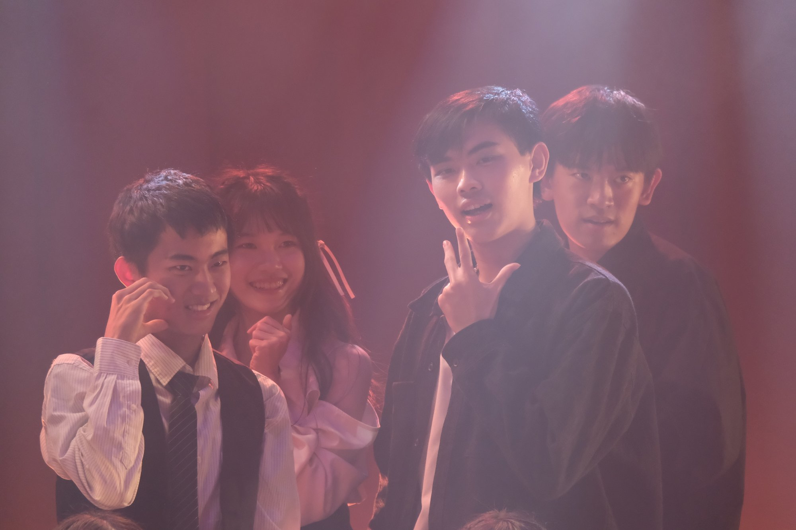

## 緣起

都是一群很可愛的人們啊！大一的時候揪了一群人一起來跳女舞，真的是我做過最快樂的決定。

去年的大一女舞只能說第一次吧，只能說一個人吧！有很多做得不夠好的地方。那個時候拉了一堆系上的人(都是後來很活躍的人們，我很開心我把一堆人拉出來跳舞甚至之後變負責人)，唉那個時候真的是什麼都不會，進度安排也出了一大堆問題，我那個時候還很自責，不過最後有順利把那支舞跳完真是太棒了，而今年，雖然我不是負責人，但我也依然加入了今年的 KPOP，和大家同樂。

## 練習

再來是大二 KPOP，必須感謝三位負責人（idk 你們怎麼分工，但感覺就是三位）潘葦軒、石晏禎、張宸嘉，第一次選歌跑去圖書館開會到底是怎樣啦！是要多鬧！

但必須說練 KPOP 是我過去這幾個月內心感到最踏實最無憂無慮的一段時間，照著你們排好的步調，盡可能地達成你們的期望，真的真的很喜歡跟一群自己很喜歡的人們一起完成一件喜歡的事。一周大概練習兩次，而且很早大概二驗三驗就已經把事情都做得差不多了。偶爾不用扛責任真的很開心，很謝謝今年你們把重擔都扛下來了，然後感謝林若潔帶我去挑衣服！真的很好看，難得帥了一次之後還要帶我去挑衣服哇！

謝謝今年你們把它變成一部很好很好的作品。明年這個時間我不知道我還有沒有足夠的心力投入到另一個舞上，但還是希望能夠跟你們一起哇！跟一群自己很喜歡的人一起做事就是很幸福。

## 照片們~~~

