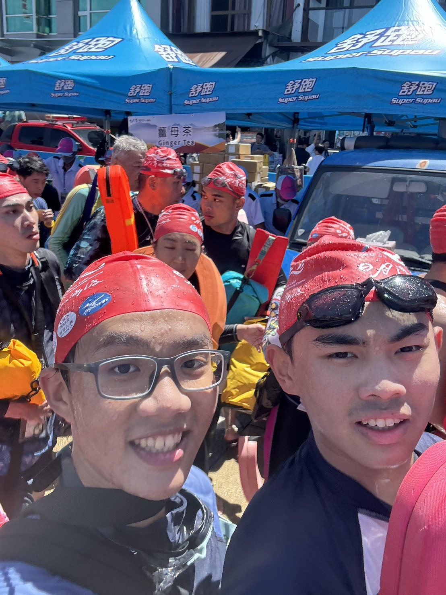

## 緣起
「ㄟ要不要去游日月潭？」那時候還沒考分科，每天就是一直在刷題吃飯睡覺、刷題吃飯睡覺，吃飯滑手機的時候看到了賴泓安傳來的訊息，也沒想太多吧！3.3公里一定游得完，而且也是台灣人特有的成就之一（對啊是說我們什麼時候要來單車環島），所以我就回了「好啊！」，男人的對話框就是這樣，哪有那麼多彎彎繞繞。最後去的人就是我、賴泓安、王元粲、陳彥臻、李允中。

## 前一天
必須說，整個泳渡日月潭我覺得最難的完全不是游泳，最難的是上山和下山。我們到台中車站出來，一大堆人都在排公車，就在我們絕望於到底要怎麼上山的時候，旁邊有兩個大哥問了我們要不要拼車一起上山。現在想想能遇到那兩位大哥還真是幸運，不然我們到飯店可能都凌晨了。一路上我們聊了很多東西，只能說台大的身分還是蠻好用的，大哥聽到之後講話都變得客氣不少。而且大哥很酷耶，一天到晚去各種不同的地方騎腳踏車、參加鐵人三項，哪天我四十幾歲也蠻想活成他那樣子的，四十幾歲的人了還那麼有精神，看著健康的人我就很喜歡。

到了之後，因為飯店是陳彥臻訂的，我們當下又聯絡不上他，只能在大廳休息。飯店的人也蠻好的，還準備了一些紅燒肉、滷蛋、湯讓來這邊的人吃，那個時候好像沒吃晚餐吧，狼吞虎嚥了一波，說實在還蠻爽的。ㄟ不對，我記得那一次一個晚上一個人要四千，是前一天的兩倍！貴死了，我只能說準備這些是應該的。當天晚上......好像也沒有特別幹嘛，休息完就早一點回去睡覺了。

## 當天
必須說很震撼耶，真的是萬人泳渡日月潭，前往下水點的一路上滿滿的都是人，一眼望過去都是主辦單位發的紅色泳帽。我們好像是八點下水，那一天天氣還蠻炎熱的，一開始下水的時候真的挺冰涼，水沒有說特別髒，我游完身體也沒有任何紅腫發癢，挺不賴的。而且這是我第一次在開放水域游泳，那種踩不到地的感覺說實話還真的有點可怕。反正就開始游啊，游一游就只剩我跟賴泓安在最前面。主辦單位還蠻讚的，每隔50公尺就會有人餵水，我們就像魚一樣蹲在旁邊把嘴張開。到現在唯一還有印象的，大概就是人很密集，所以一直踢到別人、還有被別人踢吧！超級可怕。

游過去差不多是十一點，說實話上岸之後的事情我都忘了，好像身上扛了一個人的感覺，走起路來特別重。我只記得我們走了很久，真的是很久很久很久，最後是靠陳彥臻他爸 carry 我們，才有回台北的客運車票。必須說真的超遠，大概開了快六個小時吧，兩三點的車到台北都八九點了......整體來說我覺得推薦嗎？也還好，就有一種解鎖人生成就的感覺吧，但也真的是找罪受就是了。每年都去的話，除非你像馬英九一樣有專車接送，不然都挺麻煩的。

是說什麼時候要游澎湖灣啊