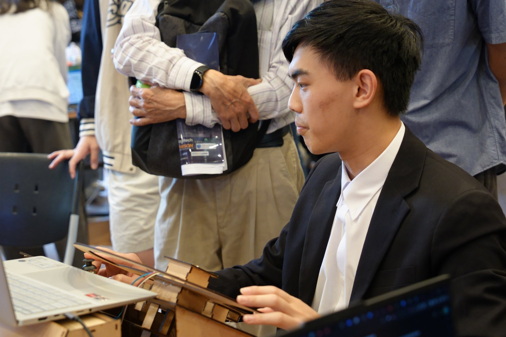
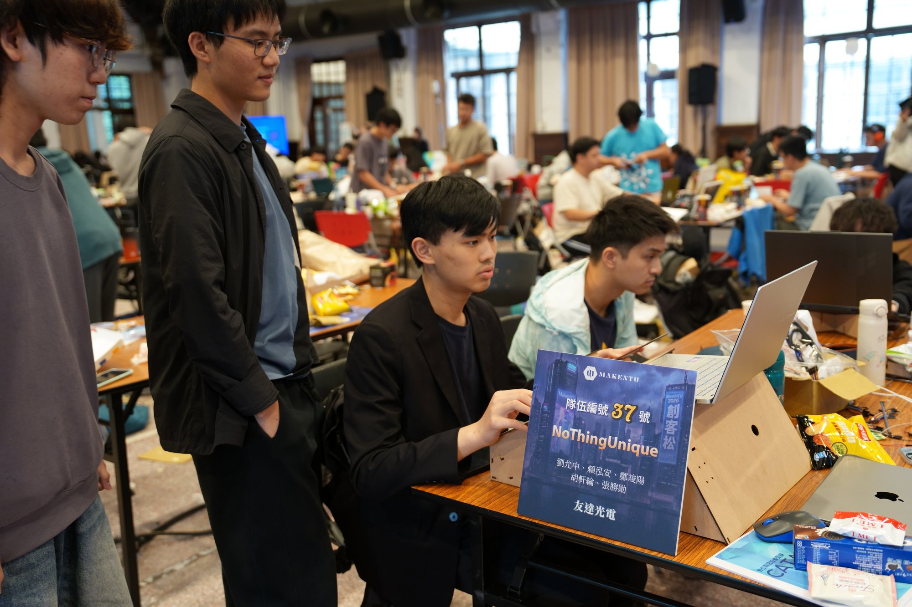

**May 8–10, 2026**

## The brief

AUO makes display panels, and the sponsor prompt came down to a single
question: if the windshield itself becomes the display, what is actually worth
putting on it? The easy answer is a bigger speedometer. We treated it as an
interface problem instead — the glass should show what the driver's current
state calls for, and stay out of the way otherwise.

## What we built

A first-person driving simulator that runs entirely in the browser, built on
real map data: the Xinyi district road network pulled live from OpenStreetMap
Overpass, routes from OSRM, and procedurally generated buildings filling the
blocks in between. Four scenarios ship — city, highway, coastal drive, and a
parked rest stop.

The windshield is composed in four layers, so the result reads as glass rather
than as a game overlay:

| Layer | What is in it |
| --- | --- |
| 4 · Glass | Vignette, film grain, top tint, A-pillars and mirror silhouettes |
| 3 · HUD | Frosted DOM/SVG panels — speed, compass, nav card, ETA, climate, now playing, minimap |
| 2 · AR | POI cards projected into screen space onto building facades, fading when occluded |
| 1 · World | Three.js — roads, buildings, cabin, traffic agents, route arrows, destination pillar |

And the subsystems that make it more than a renderer:

| Subsystem | How it works |
| --- | --- |
| **Driver monitoring** | MediaPipe FaceLandmarker blendshapes feed one state machine with two outputs. Hard warning: both eyes shut past 1.2 s, cooldown-gated so it does not machine-gun at a driver who is genuinely asleep. Continuous 0–1 fatigue score: rolling PERCLOS (a one-minute EMA of eyelid closure) combined with yawn rate — a jaw held open past 0.55 for 800 ms counts as a yawn, over a two-minute window. |
| **Fatigue-driven HUD** | The score is the interesting half. As fatigue climbs the HUD raises contrast on rear traffic, sheds non-essential chrome, and drifts wake-up particles across the glass — the display responds to the driver instead of shouting at them. |
| **Head-pose lane-change intent** | Looking more than 18° to one side for 800 ms reads as a shoulder check, and the panel surfaces rear traffic in that adjacent lane. Releases at a looser 8° with a 500 ms cooldown — hysteresis, so a brief glance forward does not flicker the panel on and off. |
| **Door-opening safety gate** | In rest mode the car is parked roadside with traffic flowing past. Asking to get out forward-simulates the traffic schedule: if any vehicle will come within 12 m of the door in the next 4 s the gate stays red, otherwise a tap confirms. |
| **Voice + AI reservation call** | Speech recognition is always listening. Say 「找餐廳」and five nearby POIs come back from Overpass; pick one by number and the in-car assistant dials it, speaking a reservation script over TTS while the overlay renders the transcript as chat bubbles. Phone numbers carry a separate spoken form so Chinese TTS reads them digit by digit instead of turning 09 into a place value. |
| **Four-screen cabin** | Each screen runs the same app with `?role=driver / passenger / left / right`. The driver publishes state snapshots to a small WebSocket relay that fans them out unparsed; each role applies its own camera offset — passenger 0.45 m inboard of the right door, side windows yawed ±90° — and keeps its own mouse-look on top, so a passenger can still turn their head independently. |
| **Physical steering wheel** | You drive it with an actual wheel. Steering angle comes off a six-axis IMU (three-axis accelerometer plus gyroscope) mounted on the wheel itself, so the rotation is read directly from how the wheel moves — no shaft encoder or mechanical end-stops to fabricate in three days. An Arduino Nano packages the reading as one JSON line per packet at 115200 baud, roughly 20 packets a second, which the browser reads through Web Serial. Every value is clamped on arrival so a noisy reading cannot push the vehicle physics past its own caps, and the 60 fps render interpolates between packets rather than stepping. |

## My role

I was the team lead. The sponsor prompt named a display, not a product, so most
of the work up front was deciding what a windshield should actually do — I ran
that ideation with the team, and then led the software side through to a working
demo. My own commits landed the highway, coastal and rest-stop scenarios, the
driver-monitoring pipeline and everything the fatigue score drives, collision
handling, the head-pose lane-change intent, and the exit gate.

Roughly 20k lines of TypeScript went in over the three days, with
194 unit tests across 16 files covering the pure logic — the state machines,
geometry and traffic simulation are all written as pure functions precisely so
they could be tested at hackathon speed instead of debugged through the UI.

## Results

First place, AUO corporate award.

